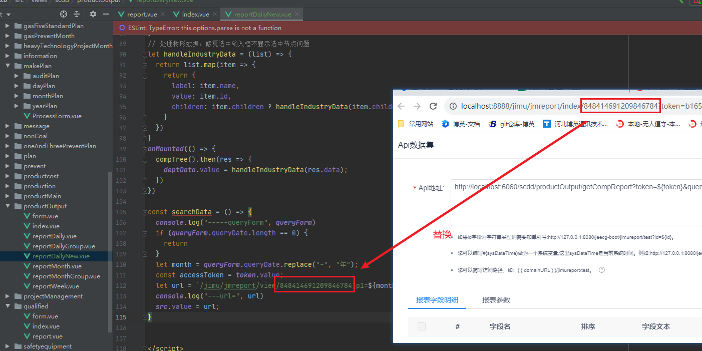
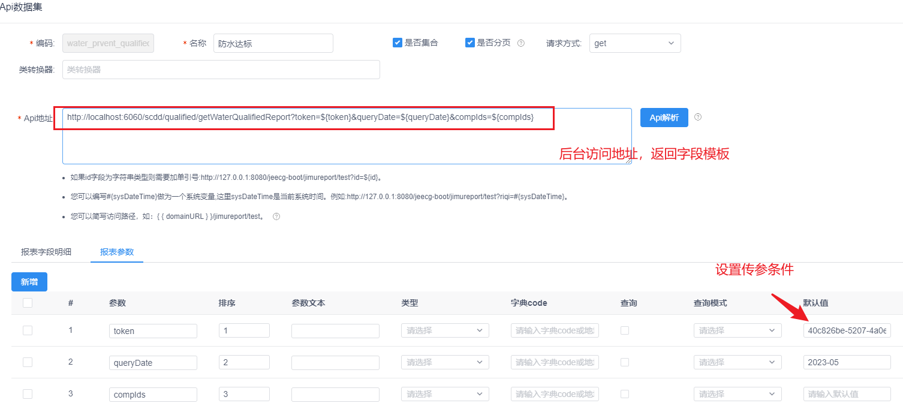
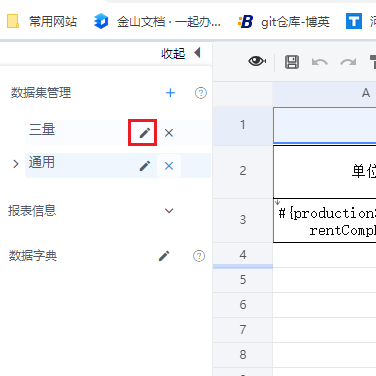
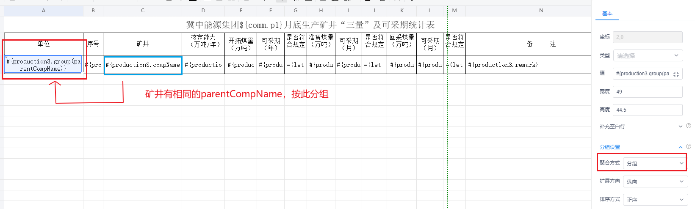
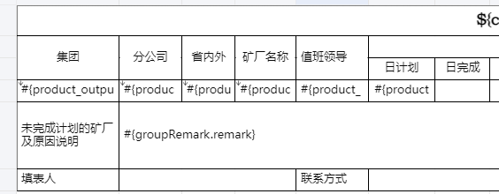
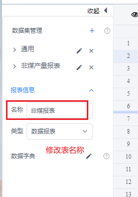
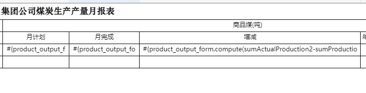
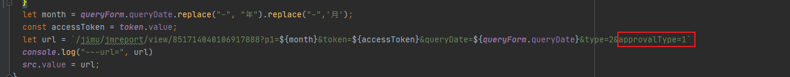
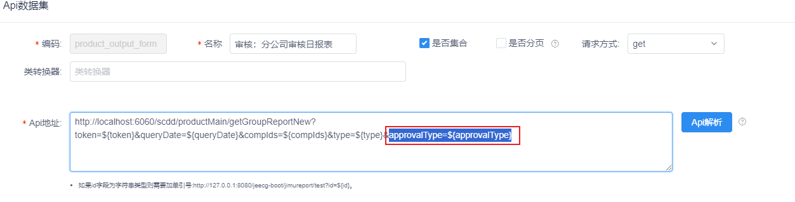
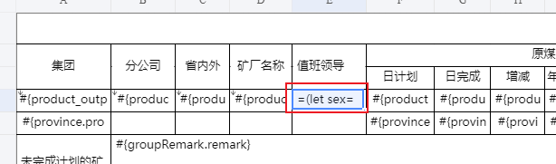

### 积木报表使用教程

使用笔记，以pig框架“生产调度”项目为例

#### 1，设置id

**注意“Api解析”时还要加正确的token，否则连接口都无法访问，提示“数据为空”**

新建报表后，uri中的id要替换report.vue中的对应id;



```javascript
const searchData = () => {
  console.log("-----queryForm", queryForm)
  if (queryForm.startDate.length == 0) {
    return
  }
  let month = queryForm.startDate.replace("-", "年");
  const accessToken = token.value;  //
  let url = `/jimu/jmreport/view/823435907219279872?  p1=${month}&token=${accessToken}&startDate=${queryForm.startDate}&compIds=${queryForm.compIds}`
  console.log("---url=", url)
  src.value = url;
}
```

#### 2，点击新建，或编辑

选择 “API数据集”，进行设定访问接口


如果是多条数据需要勾选集合


设置api接口及传参

#### 3，接口返回数据写法





```java
//上面设置访问后台此地址
@RequestMapping("/qualified" )
public class WaterPreventQualifiedController {/**
	 * 积木报表
	 * @param waterPreventQualified
	 * @return
	 */
	@GetMapping(value = "/getWaterQualifiedReport")
	public JIMUReportVo getWaterQualifiedReport(WaterPreventQualified waterPreventQualified,String compIds, String queryDate){
		if (StrUtil.isEmpty(queryDate)){
			return null;
		}
		List compIdList = null;
		if (StrUtil.isNotBlank(compIds)){
			compIdList = Arrays.asList(compIds.split(","));
		}
		QueryWrapper<WaterPreventQualified> qualifiedQueryWrapper = new QueryWrapper<>();
		qualifiedQueryWrapper.eq("plan_date", DateUtil.beginOfMonth(DateUtil.parse(queryDate, "yyyy-MM")));
		qualifiedQueryWrapper.in(ObjectUtil.isNotEmpty(compIdList),"comp_id",compIdList);
		List<WaterPreventQualified> waterPreventQualifiedList = waterPreventQualifiedService.listScope(qualifiedQueryWrapper);
		return new JIMUReportVo(waterPreventQualifiedList);  //数据要放到JIMUReportVo进行封装

	}
    
    
    
}

```


编辑原来设置好的




#### 4，分组设置

点击需要分组的列，设置好分组，每行有相同的parentCompName即可分为一组



#### 5，小计功能

首先设置好分组之后，才设置小计，选中需要小计的列，即可按组求和。

##### 1，点击分组的父列，设置为分组依据


##### 2，点击需要小计求和的列，设置求和

注意，不要把小计的列选为分组依据：”是“。


##### 3，多重分组后最后一列的“合计”不显示

原因：设置错误，最后一个分类设置“分组”为“是”，但是不要设置为“分组依据”。

例：下面的的“集团”“分公司”“省内外”都设置成“分组：是”和“分组依据”，只有最后一个“矿厂名称”设置为“分组:是”，不要设置“分组依据”，否则最后一个“合计”不显示




#### 6，修改表名称



#### 7，分组求和后，再使用积木自带的函数compute()

如下例，月计划，月完成设置分组求和就可以了，增减使用了compte()函数不要设置分组求和，会自动求。若设置的话报表会展示错误。



#### 8，积木报表返回的数据不可为null

可以是空对象，但不能为null，会导致表格解析报错

```java
public JIMUReportVo getApprovalNames(String approvalType,String queryDate){
    //new JIMUReportVo(..)里的实参不可为null
    return new JIMUReportVo(reportApprovalJimu == null ? new ReportApprovalJimu() : reportApprovalJimu);
}
```

#### 9，积木报表uri传参设置

前端页面加好参数之后，管理页面API数据集里也要加。后端接口设置同名参数接收数值。否则不管用。





#### 10，“合计“行里加别的属性，条件表达式

参照：https://help.jeecg.com/jimureport/function/condition.html

```javascript
=(let s='#{product_output_form.provinceName}'; 
      leader='#{product_output_form.leaderName}'; 
      parentLeader='#{product_output_form.parentLeaderName}';
if(s== '合计'){
   return  parentLeader;
}else{
   return leader;
})
```



当省内外显示积木自己生成的"合计"的时候，就返回parentLeader，否则还是返回原来的leader，这样就达到了在"合计"行里显示分公司值班领导的目的。

