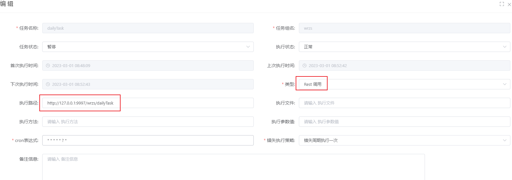

1，步骤

注意选Rest调用，写全路径，可以调用子模块的接口。

实际就跟访问接口一样，注意接口要加@Inner(false)，否则无法访问。

因为定时任务类在独立的模块，不在主模块，所以不要用其他方式，如java,spring bean等是调用主框架的类的。



```java
/**
 * 根据规则生成每日预约任务
 * */
@Controller
public class YyDailyTaskController {

    private static Logger logger = LoggerFactory.getLogger(DailyTaskController.class);
    @Autowired
    private YyDailyService yyDailyService;


    @RequestMapping(value = "/dailyTask")
    @Inner(false)
    public void dailyTask(){
        logger.info("=============生成每日计划任务开始==============");
        QueryWrapper<YySetting> queryWrapper = new QueryWrapper<>();
        queryWrapper.eq("del_flag","0");

        LocalDateTime now = LocalDateTime.now();
        String format = now.format(DateTimeFormatter.ofPattern("yyyy-MM-dd"));
        logger.info("format==>" + format);

        logger.info("=============生成每日计划任务结束==============");


    }
}
```

