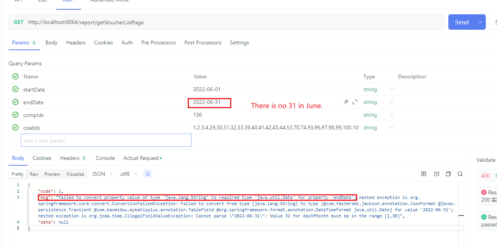

#### 1，NoClassDefFoundError: sun/misc/BASE64Decoder错误

问题背景

最近在项目里需要对jdbc.[properties](https://so.csdn.net/so/search?q=properties&spm=1001.2101.3001.7020)文件中的明文信息进行加密，所以接触到加密解密相关的操作，在进行编码转换的过程中，遇到了`BASE64Decode`r错误。

解决思路

使用 import org.[apache](https://so.csdn.net/so/search?q=apache&spm=1001.2101.3001.7020).commons.codec.binary.Base64对原先的sun/misc/BASE64Decoder进行替换

步骤1

通过[maven](https://so.csdn.net/so/search?q=maven&spm=1001.2101.3001.7020)导入`org.apache.commons.codec.binary.Base64`包

```
<dependency> 
	<groupId>commons-codec</groupId> 
	<artifactId>commons-codec</artifactId> 
	<version>1.6</version> 
</dependency> 
```

然后刷新maven

步骤2

将原先的`BASE64Encoder`进行替换

```
BASE64Encoder base64encoder = new BASE64Encoder();
return base64encoder.encode(xxx);
```

替换为

```
Base64 base64encoder = new Base64();
return base64encoder.encodeBase64String(xxx);
```

同理，解码部分也替换为

```
Base64 base64decoder = new Base64();
byte[] bytes = base64decoder.decodeBase64(str);
```

#### 2，Ambiguous，RequestMapping相关，请求路径重复

原因：多个接口用了一个访问路径uri，导致系统不知道请求哪个，去除重复路径

#### 3，网页上传图片显示413 Request Entity Too Large

原因： [Nginx](https://so.csdn.net/so/search?q=Nginx&spm=1001.2101.3001.7020)默认的request body为1M，小于我们上传的大小 

解决方案：在对应的转发项目中尽心如下设置

```txt
server{
	client_max_body_size 10m;  #自定义nginx的限制上传大小为10m
	location / {
	  ....
	}
}
```

#### 4，Failed to parse multipart servlet request

完整报错

```txt
Failed to parse multipart servlet request; nested exception is java.io.IOException: The temporary upload location xxx is not valid
```


1.重启你的项目就可以了（我采用的这种）

你还可以尝试以下方式

2.在application.yml文件中设置multipart location ，并重启项目

```yaml
spring:  
  http:    
  	multipart:      
  		location: /data/upload_tmp
```

3.添加启动参数 -java.tmp.dir=/path/to/application/temp/，并重启

**报错原因**

 主要原因为 springboot打jar包通过java  -jar启动的项目，如果上传文件会在linux的/tmp/下生成一个tomcat\*的文件夹，上传的文件先要转换成临时文件保存在这个文件夹下面。由于临时/tmp目录下的文件，在长时间（10天）没有使用的情况下，就会被系统机制自动删除掉。 所以如果系统长时间无人问津的话，就可能导致上面这个问题。 

#### 5,  List的addAll(...)方法报错:UnsupportedOperationException

出错场景：

```java
List<String> list =  Arrays.asList(couponGoodsPro);
List<String> storePromotionList = Arrays.asList(promotionStore);
```

原因：Arrays.asList()方法返回值是 AbstractList<E> ，是个定容集合，无法自动扩容，解决办法

```java
List<String> list =  new ArrayList(Arrays.asList(couponGoodsPro));
```

#### 6，The POM for com.jeesite:jeesite-common:jar:5.0.1-SNAPSHOT is invalid, transitive dependencies (if an

出错描述：本地启动项目报如上错误，但是maven打包项目部署正常。

出错项目harbour-project旭之林海港项目

原因：在common模块的pom中配置了相对路径引用本地jar包，而idea没有识别相对路径

jeesite:common-->pom.xml

```xml
<!--aspose.slides-19.3.jar ppt转pdf  -->
		<dependency>
			<groupId>com.bdyh.common</groupId>
			<artifactId>aspose-cells</artifactId>
			<version>8.3.1</version>
			<scope>system</scope>
			<systemPath>${project.basedir}/src/main/resources/lib/aspose-cells-8.3.1.jar</systemPath>
		</dependency>
```

解决办法把相对路径改为绝对路径，是否会影响maven打包待确认

```xml
<systemPath>H:/projects/harbor-project/common/src/main/resources/lib/aspose-cells-8.3.1.jar</systemPath>
```

参考：https://blog.csdn.net/weixin_30826761/article/details/96637742

#### 7，failed to find properties under “spring” java.util.Map

原因：yaml文件格式缩进错误，或冒号后没有空格

#### 8，非操作数据代码导致事务超时

有条设置时间为00:00 - 23:59，当加到最后一个时间段的时候，例如22:50 + 15:00就成了00:05 ，又小于23:59了，开始死循环。

总结：
因为报的错一直是：Lock wait timeout exceeded，导致一直排查个人写的操作数据库语句，实际下面的死循环的非操作数据库的代码写在了整个事务中，导致事务无法提交，最终超时。

**排查错误的时候，有时候报错只是表面现象，要一步步debug往下排查，尤其在事务中的循环语句要重点关注。**

```java
//无人值守项目：错误代码
//组装集合
    private List<YyDaily> getDailyList( YySetting yySetting){
        List<YyDaily> dailyList = new ArrayList<>();
        //停运，则不生成预约表
        if(2 == yySetting.getType()){
            return dailyList;
        }
        //开始时间
        LocalTime start = LocalTime.parse(yySetting.getStartTime(), DateTimeFormatter.ofPattern("HH:mm"));
        //预存每天开始时间
        LocalTime tempStart = start;
        LocalTime end = LocalTime.parse(yySetting.getEndTime(),DateTimeFormatter.ofPattern("HH:mm"));
        LocalDate startDate = yySetting.getStartDate();
        LocalDate endDate = yySetting.getEndDate();
        while(startDate.compareTo(endDate) <= 0){
            System.out.println("========1111=======");
            
            for(;start.compareTo(end) < 0;){
                //这里一直循环
                System.out.println("========2222=======");
                YyDaily yyDaily = new YyDaily();
        
                BeanUtil.copyProperties(yySetting,yyDaily,"id","createBy","createTime","updateBy","updateTime","delFlag");
                //时间段开始时间单独设置
                yyDaily.setStartTime(start.toString());
                //单独设置预约表每行的日期
                yyDaily.setSendDate(startDate);
                //关联预约设置表id
                yyDaily.setSettingId(yySetting.getId());
                IntervalTimeStrategy timeStrategy = null;
                if(0 == yySetting.getSeparate()){  //按小时分割
                    timeStrategy = new PlusHour();
                    start = timeStrategy.plus(start,1L);
                }else if(1 == yySetting.getSeparate()){  //按分钟，30分钟
                    timeStrategy = new PlusMinute();
                    start = timeStrategy.plus(start,30L);
                }else if(2 == yySetting.getSeparate()){  //按分钟，一刻钟
                    timeStrategy = new PlusMinute();
                    start = timeStrategy.plus(start,15L);
                }
                //设置该时间段结束时间
                if(start.toString().compareTo(yySetting.getEndTime()) > 0){
                    yyDaily.setEndTime(yySetting.getEndTime());
                }else{
                    yyDaily.setEndTime(start.toString());
                }
                dailyList.add(yyDaily);
            }
            //每天开始时间初始化
            start = tempStart;
            startDate = startDate.plusDays(1);
        }
        return dailyList;
    }
```

#### 9，对象套自己导致json解析报错，内存溢出

com.fasterxml.jackson.databind.exc.InvalidDefinitionException: Direct self-reference leading to cycle 

原因：一个对象中有一个自己的属性，且赋值值也是自己，即自己包含自己了，导致json解析toString()递归无穷尽。

参考：https://blog.csdn.net/weixin_45481821/article/details/127143626

#### 10 ，Feign自动把Get 请求变为Post

报错信息

```txt
 FeignException$InternalServerError  Request method 'POST' not supported
```

原因：就是Feign默认使用的连接工具实现类，发现只要你有对应的body体对象，就会强制把GET请求转换成POST请求。

解决办法：在Feign请求的形参前加@RequestParam注解，框架扫描时看到这个参数自动会把请求值放到param里面，而不会放到body里

```java
@GetMapping("/dept/getDeptByName")
R<SysDept> getDeptByName(@RequestParam("name") String name,@RequestHeader(SecurityConstants.FROM) String from);
```

参考：https://blog.csdn.net/zcswl7961/article/details/106328174

#### 11，项目部署@project.artifactId@导致报错

内容：

```txt
Application run failed org.yaml.snakeyaml.scanner.ScannerException: while scanning for the next token found character '@' that cannot start any token
```

```yaml
spring:
  application:
    name: @project.artifactId@  #把这行改成实际的项目artifactId即可。
```


#### 12,  微服务gateway启动报错

gateway启动报初始化错误：

原因：有的项目需要先启动主项目再启动gateway模块才可。

#### 13, API日期格式错误

后台已规定好接收的日期格式，传入的参数格式也正确，但是还是报错。

原因：日期不存在，入6-31没有

