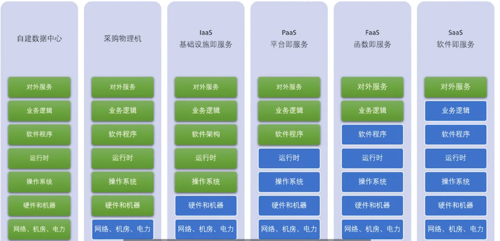

### 1，跨域问题

(1)什么是跨域？

前端服务部署的端口和后端服务部署的不在一个端口，前端调用后端api就会发生跨域。

(2)为什么会发生跨域问题？

 要同时满足三个条件才会产生跨域问题，这也就是为什么会产生跨域 。

- 浏览器限制，而不是服务端限制，可以查看Network，请求能够正确响应，response返回的值也是正确的 ；
-  请求地址的域名或端口和当前访问的域名或端口不一样 ；
-  发送的是XHR（XMLHttpRequest）请求，可以使用 a 标签（模拟xhr请求）和 img 标签（模拟json请求）做对比（控制台只报了一个跨域异常） 

(3)如何解决跨域问题？

三种方法：

- **1、客户端浏览器解除跨域限制**（理论上可以但是不现实）
- **2、发送JSONP请求替代XHR请求**（并不能适用所有的请求方式，不推荐）
- **3、修改服务器端**（包括HTTP服务器和应用服务器）（**推荐**）

第3种方法范例，SpringBoot在请求方法上加@CrossOrigin注解，表示允许跨域，具体待研究：

```java
@ApiOperation(value = "用户评价表新增")
    @PostMapping(value = "/save")
    @CrossOrigin
    public R save(/*@RequestBody*/ UserComment userComment) {  {}
```

参考：https://zhuanlan.zhihu.com/p/66484450

### 2，电商项目注意事项

电商两大重点：价格和库存。

### 3，web项目访问Alibaba  Druid的管理页面

前提是加入了Druid相关的依赖

```xml
<!--JeeSite1.2版本pom.xml范例-->
<!-- DruidStatView -->
	<servlet>
		<servlet-name>DruidStatView</servlet-name>
		<servlet-class>com.alibaba.druid.support.http.StatViewServlet</servlet-class>
		<init-param>
			<param-name>allow</param-name>
			<param-value>127.0.0.1</param-value>
		</init-param>
	</servlet>
	<servlet-mapping>
		<servlet-name>DruidStatView</servlet-name>
		<url-pattern>/druid/*</url-pattern>  
	</servlet-mapping>
```


访问地址，在项目根目录后加/druid即可

例：http://127.0.0.1:8080/jeesite/druid  ：JeeSite1.2版本的访问路径

其他Druid的配置参考：https://blog.csdn.net/weixin_43331207/article/details/106532781

### 4，项目中登录日志的保存方式

以JeeSite1.2为例

保存登录日志，保存用户点击其他菜单记录原理一样，在拦截器中保存用户访问记录，包括点击了哪些菜单，访问了哪些接口等。

在登录验证接口使用LogUtils的方法，通过解析HttpServletRequest来获取用户信息，访问uri等保存到日志表里

```java
public class SystemAuthorizingRealm extends AuthorizingRealm {
    LogUtils.saveLog(Servlets.getRequest(), "系统登录");   //第160行
}
```

```java
//其他接口的访问记录的保存，在这个拦截器里。
public class LogInterceptor extends BaseService implements HandlerInterceptor{
    
}
```

### 5， 服务器中的MySQL要修改端口号

使用默认的端口号，或者简单的密码用以被破解攻击。
同时Redis不要开放远程访问权限。

### 6，多租户和单租户的概念


### 7，云计算的概念

1.绿色表示用户自己需要做的，蓝色指的是软件服务商提供的。

2.云计算实质就是把原来需要自己搭建机房，服务器的工作改为向云计算服务商购买，云计算服务商提供类似于虚拟机的服务让用户在云计算器上搭建自己的服务项目等。

3.“云”就是互联网或者网络的一种比喻，云计算是伴随着虚拟化，网络速度发展而发展起来的。

4.下图的xxaS就是云计算的服务形式。




### 8，开发注意事项

1，有简单的问题能较快解决的，直接解决；

2，静态数据校验，注意整数溢出情况；

3，SQL并发效率检查；
4，个人自测的时候主动加错误格式数据，不要按设定的没错的测试，没有效果，用户不会按照你设想的测试；

5，多利用写好的工具类，防止重复造车轮；

### 9，for循环查询改善方案

原代码，for循环内遍历访问数据库

```java
 public R getwaterPreventQualifiedPage(Page page, WaterPreventQualified waterPreventQualified) {
        waterPreventQualified.setCompId(SecurityUtils.getUser().getCompId());
    	LambdaQueryWrapper<WaterPreventQualified> wrapper = Wrappers.lambdaQuery(waterPreventQualified);
		wrapper.orderByDesc(WaterPreventQualified::getPlanDate);
    	page = waterPreventQualifiedService.pageScope(page, wrapper);
		List<WaterPreventQualified> records = page.getRecords();
		//查询子表数据
		if(ObjectUtil.isNotEmpty(records)){
			//此处for循环遍历访问数据库，性能不好
            for(WaterPreventQualified wpq : records){
				List<WaterPreventThreeStandard> threeStandardList = waterPreventThreeStandardService.lambdaQuery().in(WaterPreventThreeStandard::getWaterPreventQualifiedId, wpq.getId()).list();
				wpq.setWaterThreeStandardList(threeStandardList);
			}
		}
		return R.ok(page);
 }
```

优化后的代码，把数据全部查询出来，放到map中。优点：后续查询速度快，缺点：占用内存较多，数据量大时慎用。

```java
 public R getwaterPreventQualifiedPage(Page page, WaterPreventQualified waterPreventQualified) {
        waterPreventQualified.setCompId(SecurityUtils.getUser().getCompId());
    	LambdaQueryWrapper<WaterPreventQualified> wrapper = Wrappers.lambdaQuery(waterPreventQualified);
		wrapper.orderByDesc(WaterPreventQualified::getPlanDate);
    	page = waterPreventQualifiedService.pageScope(page, wrapper);
		List<WaterPreventQualified> records = page.getRecords();
		//查询子表数据
		if (ObjectUtil.isNotEmpty(records)) {
			try {
				//查询所有的三标数据
				List<WaterPreventThreeStandard> allThreeStandardList = waterPreventThreeStandardService.lambdaQuery().in(WaterPreventThreeStandard::getWaterPreventQualifiedId, records.stream().map(WaterPreventQualified::getId).collect(Collectors.toList())).list();
				//将三标数据按照wpq id分组
				Map<Long, List<WaterPreventThreeStandard>> threeStandardMap = allThreeStandardList.stream().collect(Collectors.groupingBy(WaterPreventThreeStandard::getWaterPreventQualifiedId));
				//将三标数据设置到对应的wpq对象中
				records.stream().forEach(wpq -> wpq.setWaterThreeStandardList(threeStandardMap.get(wpq.getId())));
			} catch (Exception e) {
				e.printStackTrace();
				return R.failed(e.getMessage());
			}
		}
		return R.ok(page);
    }
```

### 10，对象内日期属性设置格式

因为Date类型默认是 2023-10-12  12:00:00格式的，但是后面的时分秒不需要，所以后端可按如下设置，前端只传2023-10-12即可。

```java
	@DateTimeFormat(pattern = "yyyy-MM-dd")
	@JsonFormat(pattern = "yyyy-MM-dd")
	private Date saleDate;
```

### 11，对象内属性get方法有时无法赋值

这种从Redis缓存获取数据，覆盖原来的getter的方式有时会获取不到值，尤其在高并发的情况下。原因待研究。

```java
private Long parentId;
private Long getParentId(){}
    SysDept p = RedisCacheUmpsHelper.getInstance().getDeptById(this.compId);
	parentId = p.getParentId();
    return parentIdd;
}
```

