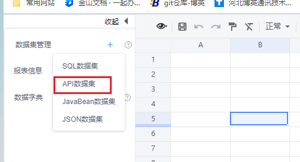
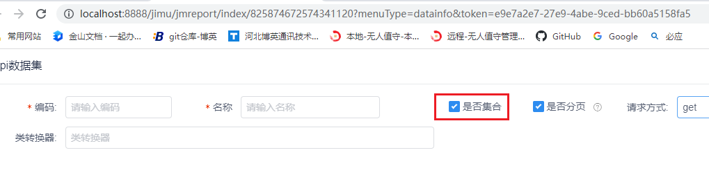
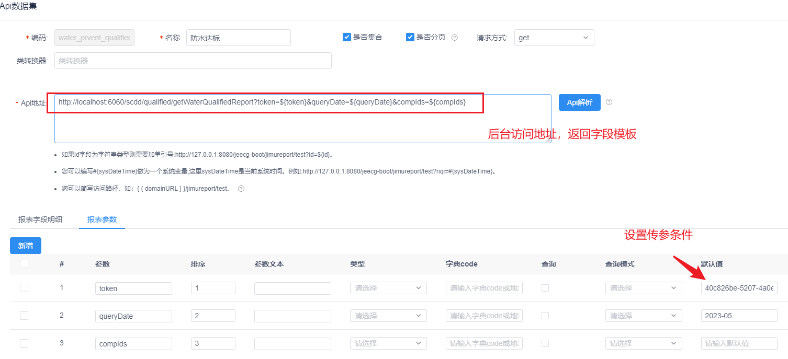
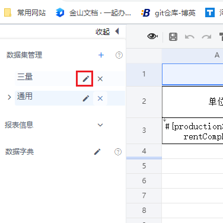
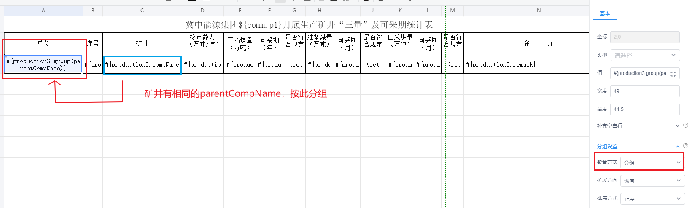
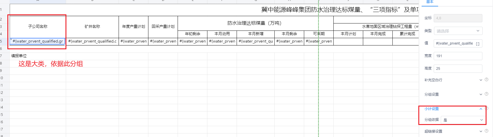
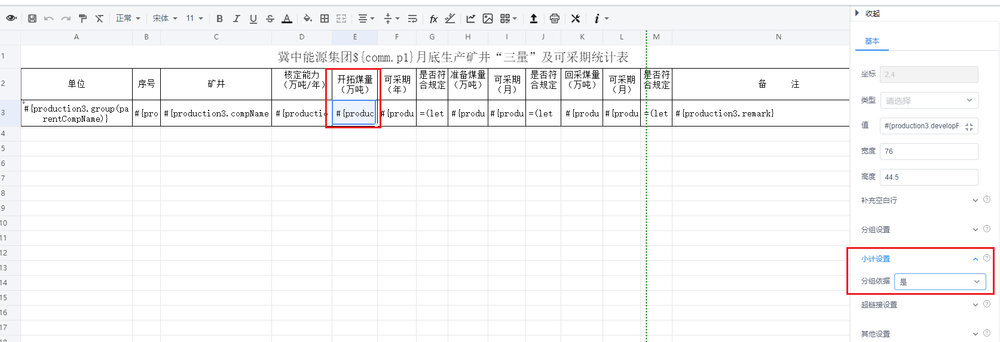

#### 积木报表使用教程

使用笔记，以pig框架“生产调度”项目为例

###### 1，设置id

注意还要加token;

新建报表后，uri中的id要替换report.vue中的对应id;

```javascript
const searchData = () => {
  console.log("-----queryForm", queryForm)
  if (queryForm.startDate.length == 0) {
    return
  }
  let month = queryForm.startDate.replace("-", "年");
  const accessToken = token.value;  //
  let url = `/jimu/jmreport/view/823435907219279872?  p1=${month}&token=${accessToken}&startDate=${queryForm.startDate}&compIds=${queryForm.compIds}`
  console.log("---url=", url)
  src.value = url;
}
```

###### 2，点击新建，或编辑

选择 “API数据集”，进行设定访问接口



如果是多条数据需要勾选集合



设置api接口及传参

###### 5，接口返回数据写法





```java
//上面设置访问后台此地址
@RequestMapping("/qualified" )
public class WaterPreventQualifiedController {/**
	 * 积木报表
	 * @param waterPreventQualified
	 * @return
	 */
	@GetMapping(value = "/getWaterQualifiedReport")
	public JIMUReportVo getWaterQualifiedReport(WaterPreventQualified waterPreventQualified,String compIds, String queryDate){
		if (StrUtil.isEmpty(queryDate)){
			return null;
		}
		List compIdList = null;
		if (StrUtil.isNotBlank(compIds)){
			compIdList = Arrays.asList(compIds.split(","));
		}
		QueryWrapper<WaterPreventQualified> qualifiedQueryWrapper = new QueryWrapper<>();
		qualifiedQueryWrapper.eq("plan_date", DateUtil.beginOfMonth(DateUtil.parse(queryDate, "yyyy-MM")));
		qualifiedQueryWrapper.in(ObjectUtil.isNotEmpty(compIdList),"comp_id",compIdList);
		List<WaterPreventQualified> waterPreventQualifiedList = waterPreventQualifiedService.listScope(qualifiedQueryWrapper);
		return new JIMUReportVo(waterPreventQualifiedList);  //数据要放到JIMUReportVo进行封装

	}
    
    
    
}

```


编辑原来设置好的




###### 3，分组设置

点击需要分组的列，设置好分组，每行有相同的parentCompName即可分为一组



###### 4，小计功能

首先设置好分组之后，才设置小计，选中需要小计的列，即可按组求和。

1，点击分组的父列，设置为分组依据



2，点击需要小计求和的列，设置求和。注意，不要把小计的列选为分组依据：”是“。



