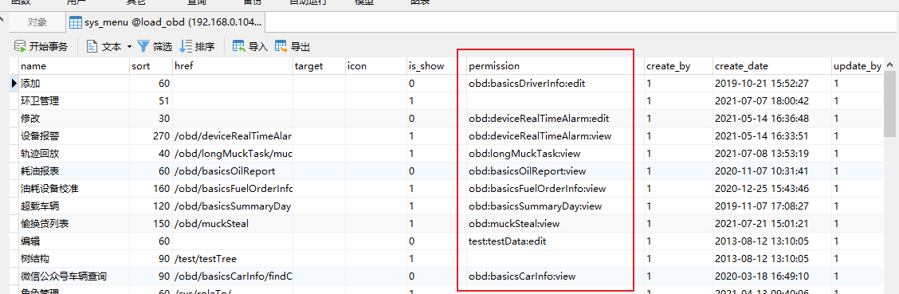

### 1，定时任务设置

spring-context.xml

```xml
<!-- 计划任务配置，用 @Service @Lazy(false)标注类，用@Scheduled(cron = "0 0 2 * * ?")标注方法 -->
    <task:executor id="executor" pool-size="10"/> <task:scheduler id="scheduler" pool-size="10"/>
    <task:annotation-driven scheduler="scheduler" executor="executor" proxy-target-class="true"/>
```

```java
    @Transactional
    @Scheduled(cron="0 0/15 4-22 * * ?")   //4-22点，没15分钟执行一次
    public void getCarInfo(){...}
```


### 2,	redis里获取的是最新里程，注意添加属性

注意对应的xxxMapper.javat添加对应属性，如: private String mileage等，xxxMapper.xml里添加对应sql语句

### 3，表添加注意事项

var 和下面的<tr><td>都要添加对应增加的列

```jsp
var ad1 = result.data.f310; //AD值1
                            var ad2 = result.data.f3110; //AD值2
                            var f36 = result.data.f36;  //载重量1
                            var f316 = result.data.f316;    //载重量2
                            var addWeight = ( Number(f36) + Number(f316) ).toFixed(2);  //重量
                            var deviceNum = result.data.terminalPhone;  //终端号
                            var fuelad1 = result.data.b21;  //油量ad值1
                            var fuel1 = result.data.fuel1;   //油量值1
                            var f312 = result.data.f312;//举升
                            if (f312 == '0') {
 "<td class='num'>"+ carNum +"</td>" +
                                "<td>"+ flag +"</td>" +
                                "<td>"+ statusField +"</td>" +
                                "<td>"+ speed +"</td>" +
                                "<td>"+ time +"</td>" +
                                "<td>"+ aim +"</td>" +
                                "<td>"+ ad1 +"</td>" +
                                "<td>"+ ad2 +"</td>" +
                                "<td>"+ addWeight +"</td>" +
                                "<td>"+ deviceNum +"</td>" +
                                "<td><span id='"+carNum+"'></span></td>" +
                                "<td>"+ fuelad1 +"</td>" +
                                "<td>"+ fuel1 +"</td>" +
                                "<td>"+ f312 +"</td>" +
                                "</tr>");
```

### 4，查询里程注意事项

表中mileage是String类型，如果前一天的里程是null时，使用Integer.parseInt(str)时辉NullPointerException

### 5，${}做为表名的变量时用法注意事项

${tabName}不用加引号，因为from后跟表名不用加引号，就为了要这个效果，使用井号#{tabName}会自动加引号，sql语句报错

```xml
<!--通过bandId查询里程，Integer getMileageById(@Param("tabName")String tabName, @Param("bandId")String bandId)-->
	<select id="getMileageById" resultType="java.lang.String">
		SELECT mileage
		FROM  ${tabName}  <！--${tabName}不用加引号-->
		WHERE  band_id = #{bandId}
		ORDER BY time
		limit 1
	</select>
```

### 6，前端页面添加内容

Ajax里有两个var 和两个<td>都要添加

```jsp
basicPositionLis.jsp
第一处： 
var deviceNum=data.data[i].deviceNum;//终端号   原来的
var mileage=data.data[i].mileage;  //当日新增里程  添加这里
……
<td>"+f312+"</td><td>"+mileage+"</td></tr>
……				    //添加这里
第二处：
var f312 = result.data.f312;//举升   原来的
var mileage=result.data.mileage;  //当日新增里程   添加这里
"<td>"+ f312 +"</td>" +
"<td>"+ mileage +"</td>" +    //添加这里
```

### 7，MySQL表的String类型可通过xxxMapper.xml里的resultType进行转换为Double等八大包装类

```xml
<!-这里把原来的表内的字段varchar即String类型作为Double返回，xxxMapper.java内方法就可接受Double类型了-->
<select id="getMileageById" resultType="java.lang.Double">  
		SELECT mileage
		FROM  ${tabName}
		WHERE  band_id = #{bandId}
		ORDER BY time
		limit 1
</select>
```

### 8，其他

以车为主，根据车查询速度，如果速度为0则判断之前是否存过为0的速度，没有则存储起来，下次间隔就判断不为0时获取时间

### 9，写代码之前准备工作

搞清楚表用途，及其它们之间的关系

### 10，添加数据，删除数据任务注意事项

```java
@Transactional
    @Scheduled(cron="0 0/10 4-22 * * ?")   //向表内添加数据的时间段不能和下面删除数据定时事件冲突，否则白添加了
    public void getCarInfo(){
        
@Scheduled(cron="0 30 0 * * ?")
    public void deleteStopTime(){
        bilDao.deleteStopTime();
    }        
```

### 11， List集合元素为0,则循环不执行

```java
for(BasicsIndexLocation b : zeroList){   }    //如果zeroList内元素是0则不循环
```

### 13，模糊查询MyBatis写法

https://blog.csdn.net/weixin_43839613/article/details/94008057

```xml
<select id="findCarOrDevice" resultType="BasicsCarInfo">
		SELECT
		a.CAR_NUM AS "carNum",
		a.DEVICE_NUM AS "deviceNum"
		FROM basics_cdo_relation a
		<include refid="basicsCarInfoJoins"/>
		<where>
			a.DEL_FLAG='0'
			<if test="carNum != null and carNum != '' ">
				and a.car_num like concat('%',#{carNum},'%')
			</if>
			<if test="deviceNum != null and deviceNum != '' ">
				and a.device_num like concat('%',#{deviceNum},'%')
			</if>
		</where>
		<!-- 数据范围过滤 -->
		${sqlMap.dsf}
	</select>
```

### 14,不要向for循环里面加查询等sql语句，太卡

可把结果查询到Map集合，再通过key获取value，Map查询效率高

### 15，MySql导入sql文件太慢的解决方案

把原来同名的表清空，再导入速度会快些

### 16，Shiro菜单及请求权限相关的表


