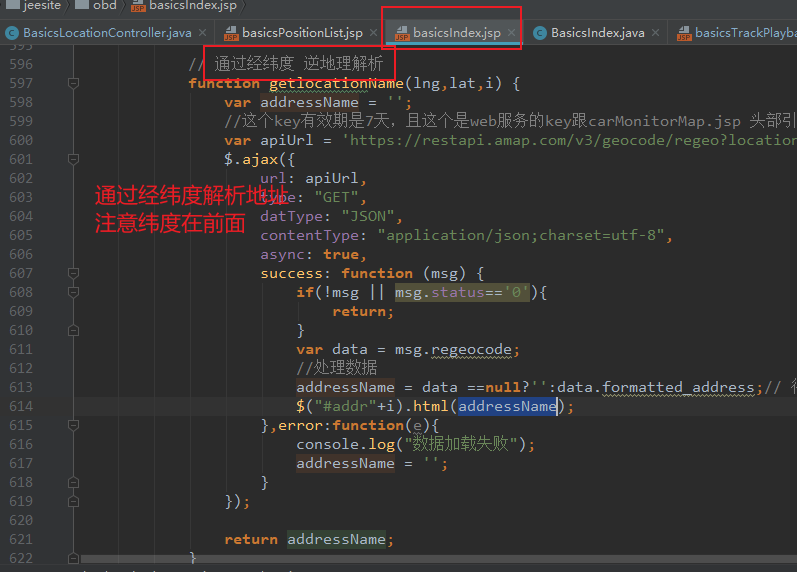
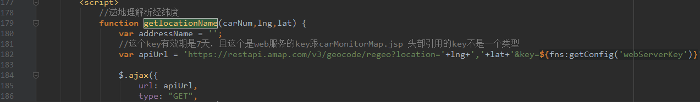
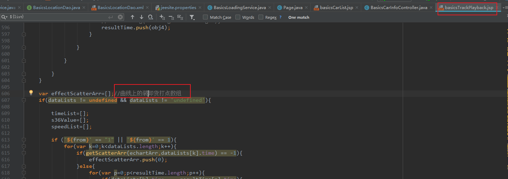
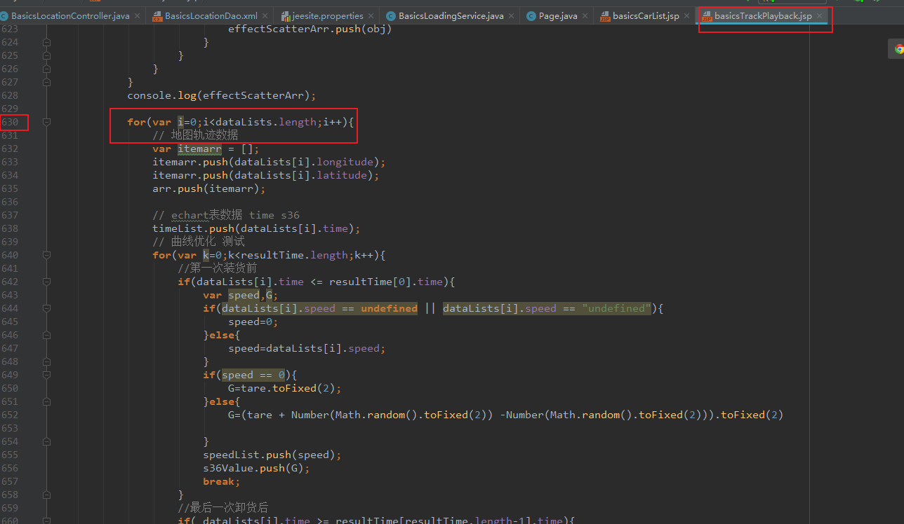
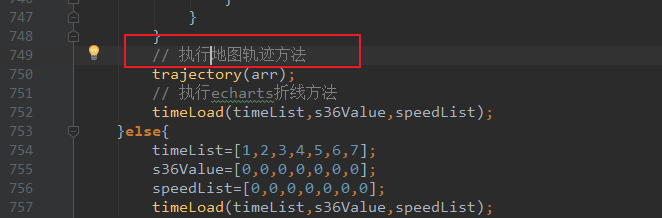
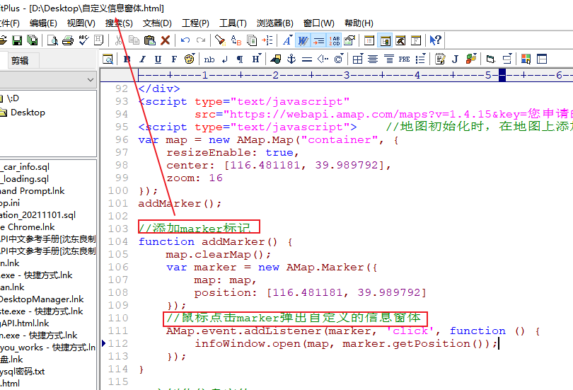
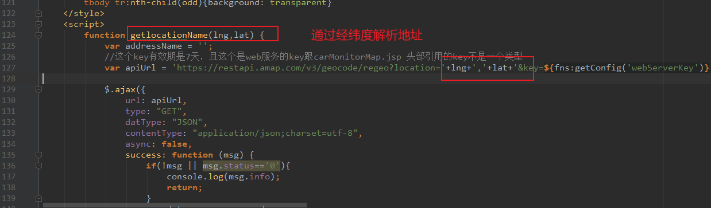
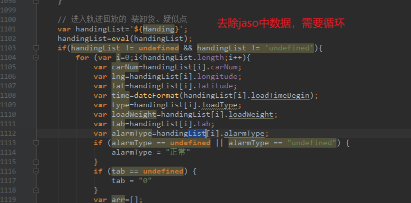
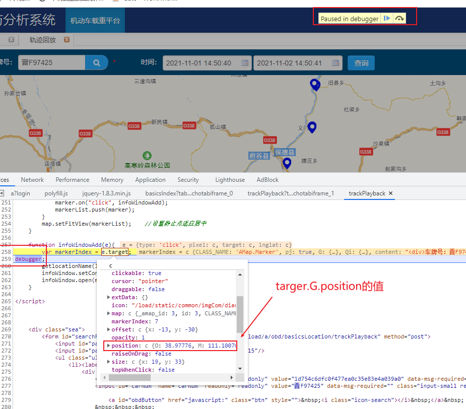

#### 1，地图打点

首页范例：marker :该属性代表地图上的一个车的图标，info就是弹出框对象

**index.jsp首页范例：**

```jsp
							// infoWindow展示的信息
                            var carNum = data.data[i].carNum; // 车牌号
                            var simNum = data.data[i].terminalPhone; // 设备号
                            var trailerNum = data.data[i].trailerNum; // 挂车号
                            //var driverName = data.data[i].driverName; // 驾驶员
                            var time = data.data[i].time; // 定位时间
                            var f36 = data.data[i].f36; // 重量
                            var f310 = data.data[i].f310; // AD1
                            var f3110 = data.data[i].f3110; // AD2
                            var tareWeight = data.data[i].tareWeight; // 空车重量
                            var fuel1 = data.data[i].fuel1; // 油量

                            var marker = new AMap.Marker({
                                map:map,
                                icon:'${ctxStatic}/common/imgCom/'+carColorImg,
                                position: [data.data[i].longitude,data.data[i].latitude],
                                offset: new AMap.Pixel(-13, -30),
                                xiabiao: i
                            });

                            var info = [];
                            info.push("<div>");
                            info.push("车牌号：");
                            info.push(carNum);
                            info.push("<br>设备号：");
                            info.push(simNum);
                            info.push("<br>挂车号：");
                            info.push(trailerNum);
                            info.push("<br>AD1值：");
                            info.push(f310);
                            info.push("<br>AD2值：");
                            info.push(f3110);
                            info.push("<br>当前位置：<span id='addr"+i+"'></span>");
                            info.push("<br>定位时间：");
                            info.push(time);
                            info.push("<br>毛重：");
                            info.push(f36);
                            info.push("<br>皮重：");
                            info.push(tareWeight);
                            info.push("<br>净重：");
                            info.push(tareWeight == null ? "0" : (f36-tareWeight).toFixed(2));
                            info.push("<br>油量：");
                            info.push(fuel1);
                            info.push("<br>车速：");
                            info.push(curSpeed==null?"0":(curSpeed=="0"?"0":curSpeed));
                            info.push(" (km/h)</div>");
                            marker.content = info.join("");
                            marker.on("click", markerClick); // 绑定点击事件
                            markers.push(marker);
                        }
                        // 给在线车辆 、运行车辆赋值
                        $("#onlineCar").html(onlineCarNum);
                        $("#actionCar").html(moveCarNum);
                        map.setZoomAndCenter(6,[data.data[0].longitude,data.data[0].latitude]);
                    },
                    error:function () {
                        console.log("数据加载失败");
                    }
```

#### 2，经纬度解析成地址



basicsPositionList.jsp



其它

basics_loading表有载重吨位数据

#### 3，轨迹图，代码位置














#### 3, target.G.position的值，逆地理解析方法里



#### 4，endTime为空在MySql中自动计算begin_time加上stop_time

```mysql
SELECT begin_time,ifnull(end_time,date_add(begin_time, interval stop_time/1000 second )) FROM `t_car_stop`
where id = 30 and band_id = '9a344dd1c7bb4999bac9e850fa9d3b26';
```

#### 5,同一个项目内，多表联查，不可写同名的resultMap的id

```xml
<resultMap type="BasicsCdoRelation"  id="map02">    //因为有一个map01了，这里要写map02
		<id column="id" property="id"></id>
		<result column="car_num" property="carNum"></result>
		<collection property="bilList" ofType="BasicsIndexLocation">
			<result column="band_id" property="bandId"></result>
			<result column="speed" property="speed"></result>
			<result column="time" property="time"></result>
			<result column="latitude" property="latitude"></result>
			<result column="longitude" property="longitude"></result>
		</collection>
	</resultMap>
	<select id="getLoadedTruck" resultMap="map02">
		select a.id,a.car_num,b.speed,b.band_id,b.time,b.latitude,b.longitude from basics_cdo_relation as a
		inner join ${value} as b
		on a.id = b.band_id

	</select>
```

#### 6， JeeSite模板添加注意事项

```java
					if(canAddAlarm){
                        deviceAlarm.setIsNewRecord(true);         //添加新纪录，要把isNewRecord设置为true,否则自动生成的id无法转换为int
                        deviceAlarm.setBandId(sti.getBandId());
                        deviceAlarm.setCarNum(halfHourMap.get(bandKey).getCarNum());
                        deviceAlarm.setAlarmTime(DateUtils.parseDate(sti.getBeginTime()));
                        deviceAlarm.setDeviceNum(bilList.get(0).getTerminalPhone());
                        deviceAlarm.setLongitude(sti.getLongitude());
                        deviceAlarm.setLatitude(sti.getLatitude());
                        deviceAlarm.setAlarmType("70");   //设置代码，编号待定
                        bdaList.add(deviceAlarm);
                    }
```

#### 7,总结

```txt
1,直接把获取的静止车辆信息，包含经纬度的参数传到前端，按照高德地图的打点方法，按照经纬度打点即可
2,轨迹网页加载完就打点事件
3,JavaScript添加元素方法： push()
4,轨迹打点要查历史表，因为前台有日期时间段选择，在BasicsLocation对象里的
5,轨迹回放的是根据车牌号，查车牌号同名的表，在load_his库里
```

